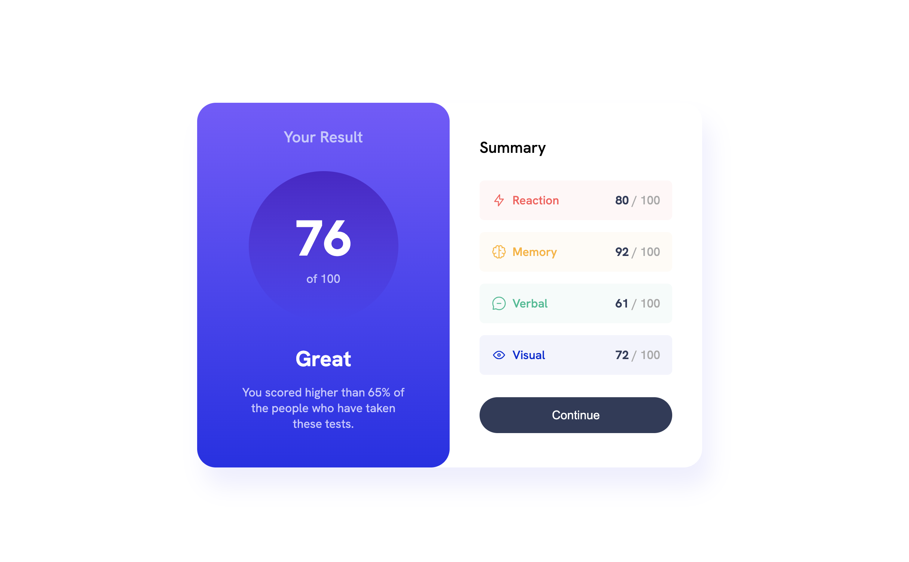
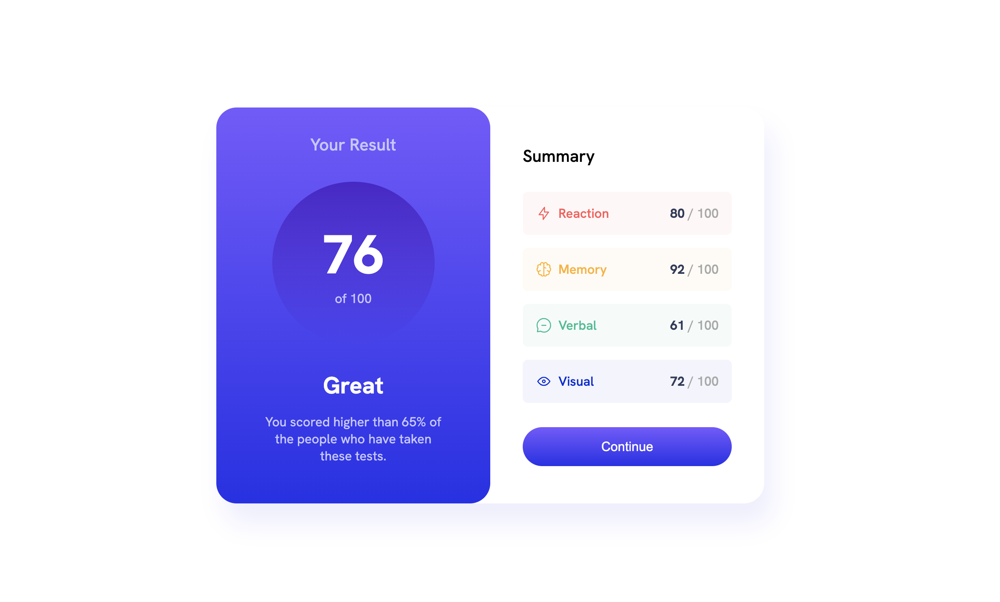
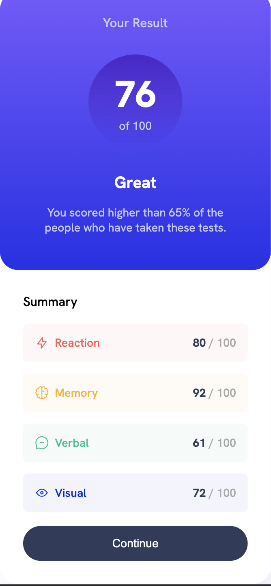

# Frontend Mentor - Results summary component solution

This is a solution to the [Results summary component challenge on Frontend Mentor](https://www.frontendmentor.io/challenges/results-summary-component-CE_K6s0maV). Frontend Mentor challenges help you improve your coding skills by building realistic projects. 

## Table of contents

- [Overview](#overview)
  - [The challenge](#the-challenge)
  - [Screenshot](#screenshot)
  - [Links](#links)
- [My process](#my-process)
  - [Built with](#built-with)
  - [What I learned](#what-i-learned)
  - [Continued development](#continued-development)
  - [Useful resources](#useful-resources)

## Overview

### The challenge

Users should be able to:

- View the optimal layout for the interface depending on their device's screen size
- See hover and focus states for all interactive elements on the page
- **Bonus**: Use the local JSON data to dynamically populate the content

### Screenshot

### Links

- Solution URL: [Solution URL]([https://github.com/Jack-OC/Result-Summary-Component](https://github.com/Jack-OC/Results-Summary-Component))
- Live Site URL: [Live Site URL]( [https://jack-oc.github.io/Result-Summary-Component/](https://jack-oc.github.io/Results-Summary-Component/))

## My process

### Built with

- Semantic HTML5 markup
- CSS custom properties
- Flexbox
- CSS Grid
- Javascript
- JSON

### What I learned

I used the challenge as chance to further my experience in creating webpages using HTML and CSS, based on a pre-made design. To further challenge myself, I decided to follow the prompt and dynamically add the scores to the component using JSON data. This was initally tricky for me, as I wasn't sure how to get the data from the file and add it to a HTML element. After some research, I decided to use the fetch() method. The fetch() method is useful for fetching JSON data from an api. The method accepts the path to data as an argument, in this case it is the address of the local JSON file. When the data is recieved the "then" function runs with the data within the respone. In case there is an issue the catch block will return an error in the console log. I then used a "for" loop to loop through the data and create a div and using .innerHTML to create HTML elements with the data and append it in the . I found this challenge to be a great exercise in learning more about JSON and javscript.

### Continued development

I will contine to research more about JSON, and how to use fetch() to dynamically populate content using data from an API.

### Useful resources

- [Example resource](https://howtocreateapps.com/fetch-and-display-json-html-javascript/) - This resource helped me to find a way to display the JSON data in HTML.
